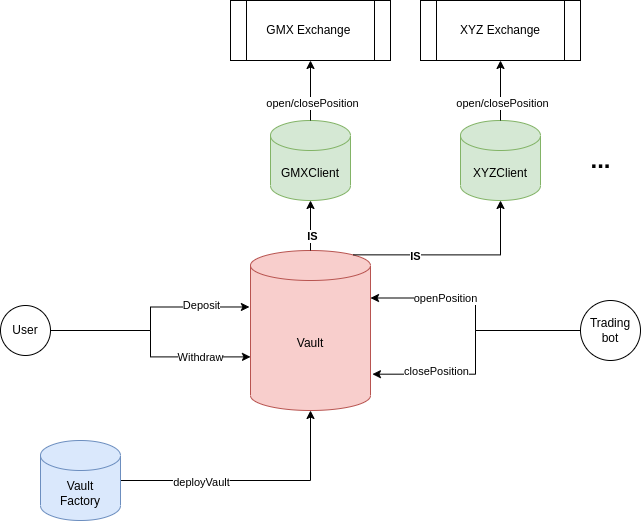

# Perpetual Vault Protocol • [](https://github.com/Rari-Capital/vaults/actions/workflows/tests.yml) [](LICENSE.md)

Non-custodial vaults that allow 
- Traders to swap perpetuals AND
- Everyone else to earn from them

## Architecture

- [`Vault.sol`](src/Vault.sol): Vault holds funds non-custodially and allows Managers to use them for perpetual trading on the GMX derivatives exchange.
- [`VaultFactory.sol`](src/VaultFactory.sol): Factory which enables anyone to deploy a Perpetual Vault.
- [`modules/`](src/modules): Contracts used for managing and/or simplifying interaction with Vaults and the Vault Factory.
  - [`GMXClient.sol`](src/modules/GMXClient.sol): Module that tracks and places orders on GMX.
- [`interfaces/`](src/interfaces): Interfaces of external contracts Vaults and modules interact with.
  - [`Strategy.sol`](src/interfaces/Strategy.sol): Minimal interfaces for ERC20 and ETH compatible strategies.



## TODO

- [ ] Track `positionOpen` state for stopLimit orders
- [ ] Performance fee model

### Run Tests

```sh
forge test
```

### Update Gas Snapshots

```sh
forge snapshot
```
